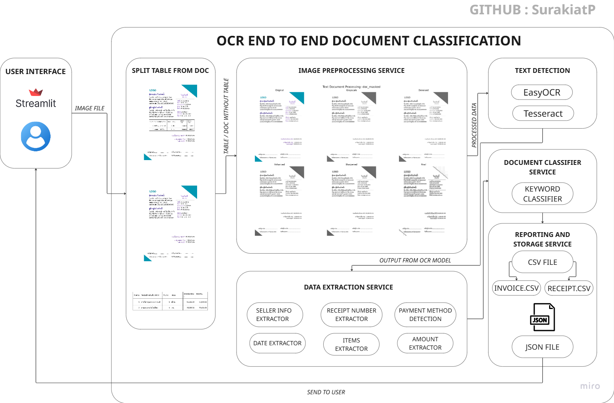
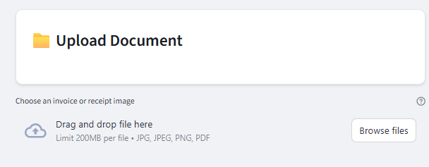
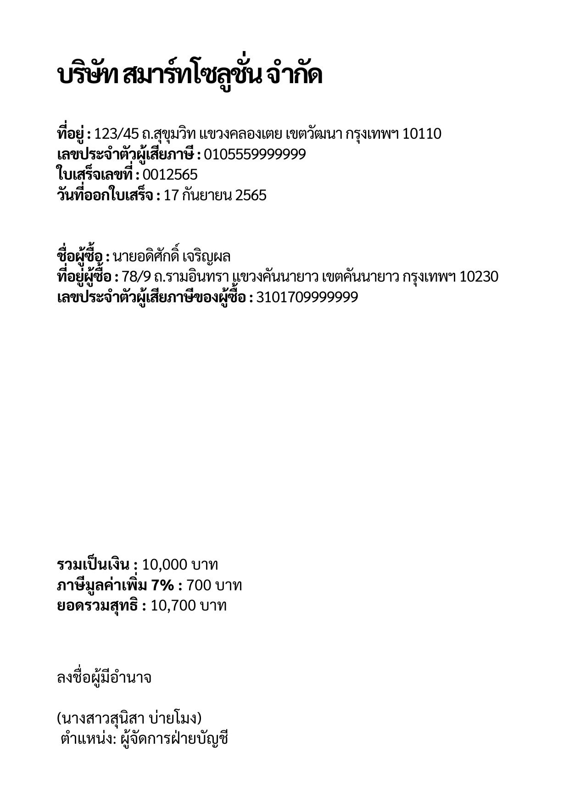
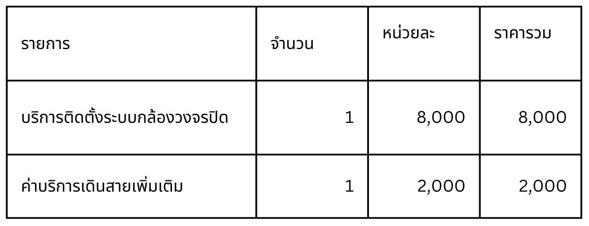
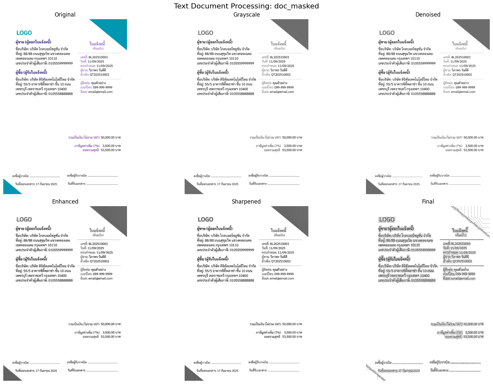
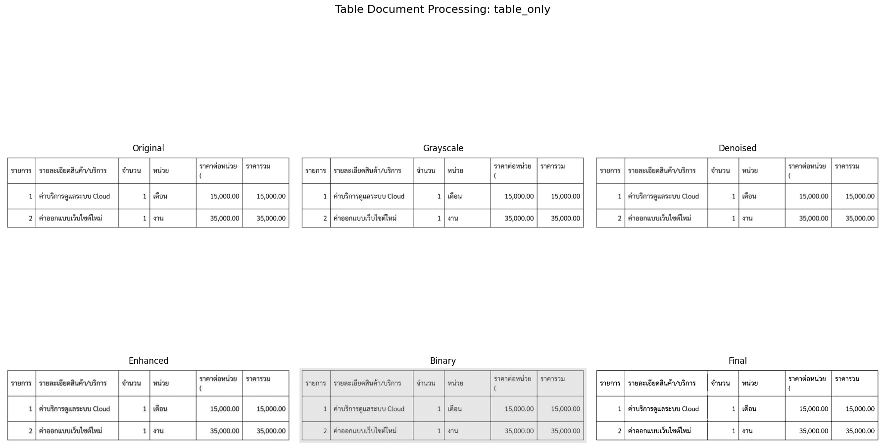
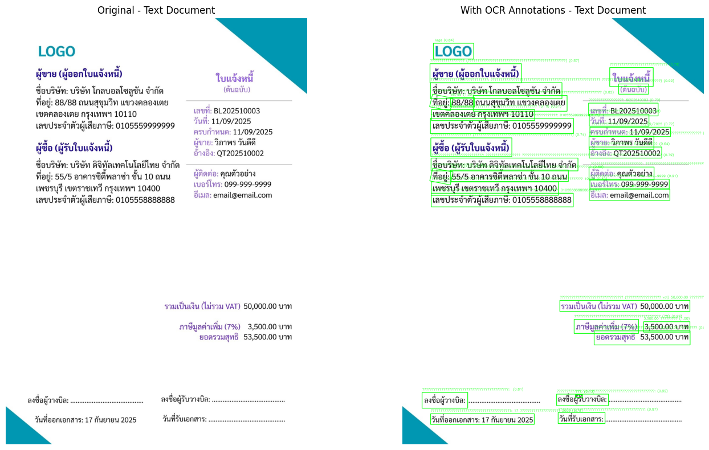
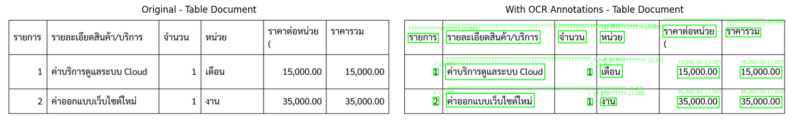
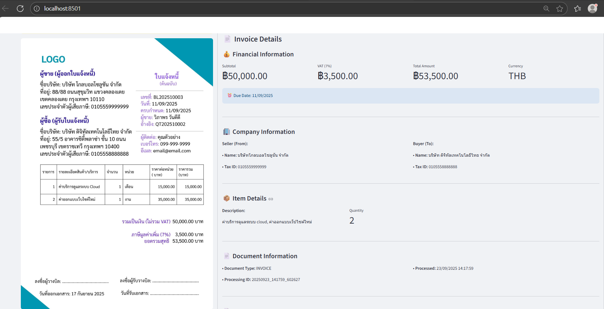

# OCR END TO END DOCUMENT CLASSIFICATION

LinkedIn Post : https://www.linkedin.com/feed/update/urn:li:activity:7376182733032824832/

AI-Powered Invoice & Receipt Analysis with OCR Technology

## Overview

This system provides automated document processing capabilities for invoices and receipts using Computer Vision and Natural Language Processing. The system can extract text from images, classify documents, and extract structured data including company information, financial details, and item descriptions.

## Project Architecture



## Project Structure

```
project_root/
├── main.py                     # Main processing pipeline
├── requirements.txt            # Python dependencies
├── README.md                  # Project documentation
├── .gitignore                # Git ignore rules
│
├── src/                      # Source code modules
│   ├── streamlit.py          # Web interface
│   ├── split_table.py        # Table detection & separation
│   ├── text_detection.py     # OCR text extraction
│   ├── text_classifier.py    # Document classification
│   └── image_preprocessing.py # Image enhancement
│
├── sample/                   # Sample documents for testing
│   ├── 1.jpg
│   ├── 2.jpg
│   └── ...
│
├── temp/                     # Temporary processing files
│   ├── splited/              # Separated table/text images
│   ├── detected/             # OCR results and annotations
│   └── processed/            # Preprocessed images
│
├── meta_data/               # Processed document metadata
│   └── meta.json            # Structured document data
│
├── csv_classifier/          # Exported CSV data
│   ├── invoice_ocr.csv      # Invoice records
│   └── receipt_ocr.csv      # Receipt records
│
└── notebooks/               # Jupyter notebooks for development
    ├── 01_split_table.ipynb
    ├── 02_image_preprocessing.ipynb
    ├── 03_text_detection.ipynb
    └── 04_text_classifier.ipynb
```

## System Workflow

### 1. Input Image File from Streamlit



- **User Interface**: Facebook-inspired web interface built with Streamlit
- **File Upload**: Supports JPG, PNG, PDF formats
- **File Validation**: Checks file size, format, and readability
- **Preview**: Displays uploaded image with metadata

```python
uploaded_file = st.file_uploader("Choose a document image", type=['jpg', 'jpeg', 'png', 'pdf'])
```

### 2. Split Table from Document






- **Technology**: OpenCV + Computer Vision
- **Process**: 
  - Detects horizontal and vertical lines using morphological operations
  - Identifies table structures through contour analysis
  - Separates document into text-only and table-only regions
  - Masks table areas in the original document

```python
# Table detection using morphological operations
horizontal_kernel = cv2.getStructuringElement(cv2.MORPH_RECT, (40, 1))
vertical_kernel = cv2.getStructuringElement(cv2.MORPH_RECT, (1, 40))
table_mask = cv2.addWeighted(horizontal_lines, 0.5, vertical_lines, 0.5, 0.0)
```

**Output**: 
- `temp/splited/doc_masked.jpg` - Document with tables masked
- `temp/splited/table_only.jpg` - Extracted table regions

### 3. Image Preprocessing





- **Enhancement Pipeline**:
  - Grayscale conversion
  - Noise reduction using bilateral filtering
  - Contrast enhancement with CLAHE
  - Image sharpening
  - Adaptive thresholding
  - Morphological operations

**Note**: Current implementation skips this step as EasyOCR performs better on original images, but the preprocessing module is available for specific use cases.

### 4. Text Detection with EasyOCR





- **OCR Engine**: EasyOCR with Thai and English support
- **Processing**:
  - Extracts text from both masked document and table regions
  - Generates confidence scores for each text block
  - Creates annotated images showing detected text regions
  - Organizes table data into structured format

```python
reader = easyocr.Reader(['th', 'en'])
results = reader.readtext(image)
```

**Features**:
- Multilingual support (Thai/English)
- Confidence-based filtering
- Spatial text organization
- Table structure recognition

**Output**:
- `temp/detected/doc_content.txt` - Extracted text content
- `temp/detected/*_annotated.jpg` - Annotated images
- `temp/detected/doc_combined_analysis.jpg` - Combined visualization

### 5. Keyword Classification

- **Document Classification**:
  - Rule-based keyword scoring system
  - Pattern matching for document numbers
  - Context analysis for document type determination

- **Data Extraction**:
  - **Document Numbers**: Regex patterns for various numbering systems
  - **Dates**: Multi-format date parsing (Thai/English, Buddhist/Christian years)
  - **Company Information**: Business name and tax ID extraction
  - **Financial Data**: Amount parsing with VAT calculations
  - **Items**: Product/service description and quantity extraction

```python
# Classification example
invoice_keywords = ['ใบแจ้งหนี้', 'invoice', 'due date', 'ผู้ซื้อ']
receipt_keywords = ['ใบเสร็จ', 'receipt', 'ขอบคุณ', 'ได้รับเงิน']
```

### 6. Data Storage

- **JSON Storage** (`meta_data/meta.json`):
  ```json
  {
    "invoices": [...],
    "receipts": [...],
    "processing_history": [...]
  }
  ```

- **CSV Export**:
  - `csv_classifier/invoice_ocr.csv` - Invoice records
  - `csv_classifier/receipt_ocr.csv` - Receipt records

- **Data Fields**:
  - **Invoice**: invoice_no, invoice_date, due_date, seller_name, buyer_name, total_amount, etc.
  - **Receipt**: receipt_no, receipt_date, seller_name, payment_method, total_paid, etc.

### 7. Output to Streamlit



- **Real-time Display**: Updates interface immediately after processing
- **Document Cards**: Facebook-style cards showing key information
- **Detailed Views**: Expandable sections with comprehensive data
- **Summary Metrics**: Total documents, amounts, and statistics
- **Error Handling**: Clear error messages and troubleshooting tips

## Installation & Setup

### Prerequisites

- Python 3.8+
- pip package manager

### Installation

1. **Clone the repository**:
```bash
git clone <https://github.com/SurakiatP/OCR-END-TO-END-DOCUMENT-CLASSIFICATION.git>
cd document-processing-system
```

2. **Install dependencies**:
```bash
pip install -r requirements.txt
```

3. **Create necessary directories**:
```bash
mkdir -p temp/{splited,detected,processed} meta_data csv_classifier sample
```

### Running the Application

1. **Start Streamlit interface**:
```bash
streamlit run src/streamlit.py
```

2. **Access the application**:
   - Open browser to `http://localhost:8501`
   - Upload document images
   - View processing results

3. **Testing individual components**:
```bash
python src/split_table.py      # Test table detection
python src/text_detection.py   # Test OCR
python src/text_classifier.py  # Test classification
```

## Technologies Used

- **Frontend**: Streamlit
- **Computer Vision**: OpenCV
- **OCR**: EasyOCR
- **Image Processing**: PIL, NumPy
- **Data Processing**: Pandas
- **Text Processing**: Regular Expressions
- **Visualization**: Matplotlib

## Features

- Multilingual OCR (Thai/English)
- Automatic document type classification
- Table structure detection and extraction
- Real-time processing with progress tracking
- Structured data export (JSON/CSV)
- Modern web interface with Facebook-inspired design
- Comprehensive error handling and logging

## Future Improvements

- Support for additional languages
- Integration with cloud storage
- Batch processing capabilities
- Machine learning-based classification
- API endpoint development
- Mobile-responsive interface

## Contributing

1. Fork the repository
2. Create feature branch
3. Make changes with tests
4. Submit pull request

## License

This project is licensed under the MIT License.

## Author

**Surakiat Kansa-ard**
- GitHub: [https://github.com/SurakiatP](https://github.com/SurakiatP)
- LinkedIn: [https://www.linkedin.com/in/surakiat-kansa-ard-171942351/](https://www.linkedin.com/in/surakiat-kansa-ard-171942351/)
